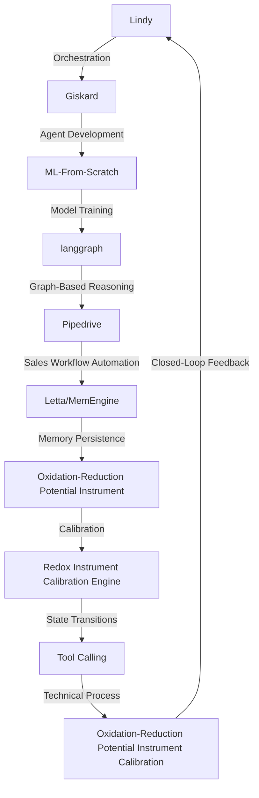

# Oxidation-Reduction Potential Instrument Calibration Engine
> "Calibrating the intricacies of redox potential with precision and finesse, one instrument at a time, through the symbiotic convergence of Lindy, Giskard, ML-From-Scratch, langgraph, and Pipedrive."

## 🏗️ Technical Architecture & Multi-Agent Flow

This intricate dance of multi-agent interactions weaves together the capabilities of Lindy, Giskard, ML-From-Scratch, langgraph, and Pipedrive to create a holistic calibration engine for redox instruments.

## 🔍 The Vertical Bottleneck: Electrochemical Impedance Spectroscopy
The realm of redox potential instrumentation is fraught with complexities, particularly in the domain of electrochemical impedance spectroscopy. This technique, crucial for understanding the dynamics of electrochemical systems, poses significant technical challenges due to the non-linear relationships between the electrode interface, the electrolyte, and the instrument itself. The high-stakes nature of these measurements demands precision and accuracy, as minor discrepancies can lead to catastrophic failures in applications such as corrosion monitoring, battery performance assessment, and biomedical diagnostics.

The mathematical underpinnings of electrochemical impedance spectroscopy involve the manipulation of complex-valued functions, which, when coupled with the inherent noise and variability of real-world systems, exacerbate the challenge of achieving reliable and reproducible results. Furthermore, the integration of these measurements into a broader workflow, encompassing data analysis, reporting, and decision-making, introduces additional layers of complexity that can hinder the adoption and effective utilization of redox potential instruments.

The calibration of redox instruments, therefore, stands as a critical bottleneck, requiring not only a deep understanding of the underlying electrochemistry but also the ability to navigate the intricacies of instrument design, data acquisition, and analysis. This necessitates a sophisticated approach that can harmoniously integrate these disparate elements, ensuring that the calibration process is both rigorous and efficient.

## 🔍 The Vertical Bottleneck: Instrumentation and Data Analysis
The instrumentation used in redox potential measurements is highly specialized, requiring careful consideration of factors such as electrode material, electrolyte composition, and temperature control. The data generated by these instruments is equally complex, involving the interpretation of impedance spectra that reflect the dynamic interactions between the electrode, the electrolyte, and the instrument itself. The analysis of these spectra demands sophisticated mathematical models and algorithms, capable of deconvoluting the contributions of various processes and extracting meaningful parameters that can inform calibration and instrument performance.

## 🔍 The Vertical Bottleneck: Workflow Automation and Integration
Beyond the technical challenges associated with electrochemical impedance spectroscopy and instrumentation, the effective utilization of redox potential instruments in real-world applications requires seamless integration into broader workflows. This encompasses not only the automation of data acquisition and analysis but also the incorporation of results into decision-making processes, whether in research, development, or quality control. The ability to automate and integrate these workflows is crucial for maximizing the value of redox potential measurements, yet it poses significant technical and logistical hurdles, particularly in environments where multiple stakeholders and systems are involved.

## 💡 The Solution: Redox Instrument Calibration Engine
The Redox Instrument Calibration Engine addresses the vertical bottleneck in redox potential instrumentation by orchestrating the capabilities of Lindy, Giskard, ML-From-Scratch, langgraph, and Pipedrive. This platform leverages Lindy for building no-code business workflows, Giskard for agent development, ML-From-Scratch for model training, langgraph for graph-based reasoning, and Pipedrive for sales workflow automation. By integrating these components, the engine creates a closed-loop system that streamlines the calibration process, from data acquisition and analysis to reporting and decision-making.

The engine's agentic reasoning capabilities, facilitated by Giskard and langgraph, enable the dynamic adaptation of calibration protocols based on real-time data analysis and feedback. This ensures that the calibration process is not only precise but also responsive to the specific needs and conditions of each instrument and application. Furthermore, the integration of Pipedrive allows for the seamless automation of sales workflows, enabling the efficient management of instrument calibration services and the maximization of resource utilization.

## 🧩 Agentic Stack Deep-Dive
The choice of Lindy, Giskard, ML-From-Scratch, langgraph, and Pipedrive for the Redox Instrument Calibration Engine is grounded in their complementary strengths and the specific requirements of the calibration process. Lindy's no-code workflow automation capabilities provide a flexible and user-friendly interface for defining and executing calibration protocols, while Giskard's agent development framework enables the creation of sophisticated, adaptive agents that can navigate the complexities of electrochemical impedance spectroscopy.

ML-From-Scratch offers a robust foundation for model training and deployment, allowing the engine to leverage machine learning algorithms for data analysis and prediction. Langgraph's graph-based reasoning capabilities facilitate the representation and manipulation of complex relationships between instruments, protocols, and applications, ensuring that the engine can navigate the intricate web of dependencies and interactions that characterize the calibration process.

Pipedrive's sales workflow automation capabilities complete the stack, providing a streamlined and efficient means of managing instrument calibration services and integrating the engine's outputs into broader business processes. The interlocking of these components creates a powerful and flexible platform that can be tailored to the specific needs of redox potential instrumentation and calibration.

## ✨ Capabilities & Features
* **Automated Calibration Protocols**: The engine provides pre-defined and customizable calibration protocols for a variety of redox potential instruments, ensuring consistency and accuracy across different applications and environments.
* **Real-Time Data Analysis**: The platform offers real-time data analysis and feedback, enabling the dynamic adaptation of calibration protocols and ensuring that instruments are calibrated to the highest standards of precision and accuracy.
* **Agentic Reasoning**: The engine's agentic reasoning capabilities, facilitated by Giskard and langgraph, enable the dynamic adaptation of calibration protocols based on real-time data analysis and feedback.
* **Machine Learning Integration**: The engine leverages machine learning algorithms for data analysis and prediction, allowing for the identification of trends and patterns that can inform calibration and instrument performance.
* **Graph-Based Reasoning**: Langgraph's graph-based reasoning capabilities facilitate the representation and manipulation of complex relationships between instruments, protocols, and applications.
* **Sales Workflow Automation**: Pipedrive's sales workflow automation capabilities enable the efficient management of instrument calibration services and the maximization of resource utilization.
* **No-Code Workflow Automation**: Lindy's no-code workflow automation capabilities provide a flexible and user-friendly interface for defining and executing calibration protocols.
* **Agent Development**: Giskard's agent development framework enables the creation of sophisticated, adaptive agents that can navigate the complexities of electrochemical impedance spectroscopy.
* **Model Training and Deployment**: ML-From-Scratch offers a robust foundation for model training and deployment, allowing the engine to leverage machine learning algorithms for data analysis and prediction.
* **Closed-Loop Feedback**: The engine creates a closed-loop system that streamlines the calibration process, from data acquisition and analysis to reporting and decision-making.

## 🛠️ Technical Implementation
The technical implementation of the Redox Instrument Calibration Engine involves the integration of Lindy, Giskard, ML-From-Scratch, langgraph, and Pipedrive into a cohesive platform. This requires the development of custom interfaces and APIs to facilitate communication between the different components, as well as the creation of a unified data model that can accommodate the diverse range of data types and formats generated by the engine.

The engine's architecture is designed to be modular and scalable, allowing for the easy addition of new components and capabilities as needed. The use of containerization and orchestration tools, such as Docker and Kubernetes, enables the efficient deployment and management of the engine in a variety of environments, from local development machines to cloud-based production systems.

## 📊 Business Impact & ROI
The Redox Instrument Calibration Engine has the potential to significantly impact the bottom line of companies involved in the manufacture and calibration of redox potential instruments. By streamlining the calibration process and reducing the need for manual intervention, the engine can help to increase throughput, reduce costs, and improve overall efficiency.

Furthermore, the engine's ability to provide real-time data analysis and feedback can enable companies to make more informed decisions about instrument calibration and maintenance, reducing the risk of instrument failure and downtime. The integration of Pipedrive's sales workflow automation capabilities can also help to maximize resource utilization and revenue generation, by enabling the efficient management of instrument calibration services and the identification of new business opportunities.

## 🚀 Getting Started
```bash
git clone https://github.com/arvind-sundararajan/redox-instrument-calibration.git
cd redox-instrument-calibration
pip install -r requirements.txt
python src/main.py
```

## 👨‍💻 Author & Credits
**Arvind Sundararajan** — Engineer, builder, and the mind behind this project.
🌐 [LinkedIn](https://www.linkedin.com/in/arvind-sundara-rajan/) | Chennai, India

---
### 🙏 Acknowledgements
- The open-source community
- The Redox (i.e., oxidation-reduction potential) instruments manufacturing practitioners who inspired this design